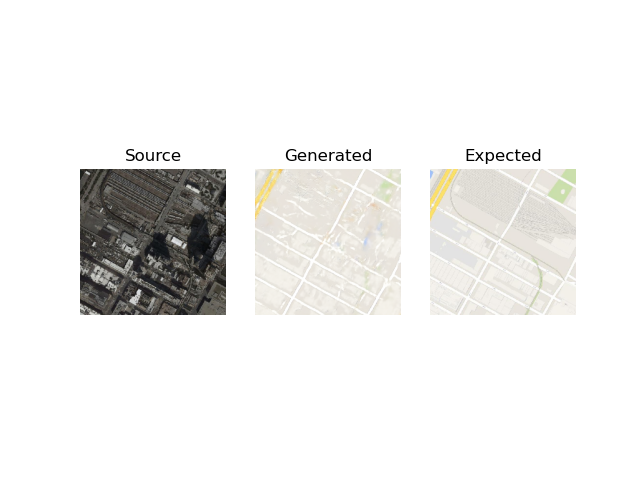

# Satellite-Images-to-Map-Layer-Translation-Using-Conditional-Patch-GAN
Creating map layers is highly advantageous for enhancing the visual experience in navigation apps. Google Maps offers various layers to make navigation easier, with the satellite imagery and default map layer being the most popular. In this project, the aim is to automatically generate a map layer using optical satellite images. Employed a conditional Generative Adversarial Network (GAN) along with a patch discriminator to produce a lifelike map layer that includes clear and intricate high-frequency elements. 

Dataset: http://efrosgans.eecs.berkeley.edu/pix2pix/datasets/

### Test Result
Few examples of predictions

